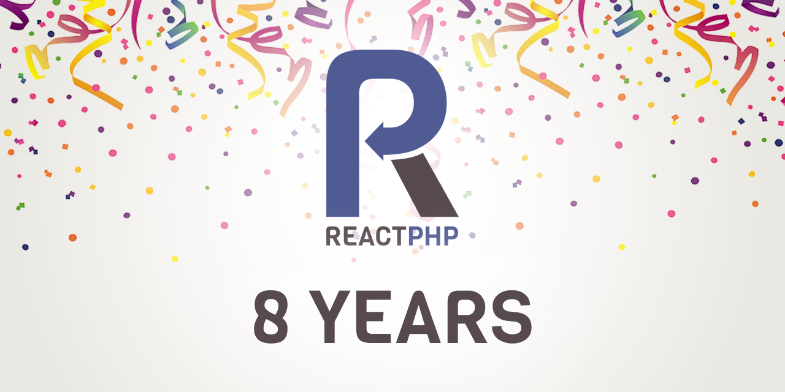

Exactly eight years ago, 11th July 2012, the very first `v0.1.0` release of ReactPHP was tagged. 
Today, the time has come again - **It's ReactPHP's birthday. 🎉**
This will be celebrated with a big birthday party and a new [react/http `v1.0.0`](https://reactphp.org/http/) component release
to ensure you will also get a big piece of the birthday cake to taste. 🍰



We're enthusiastic to announce the immediate availability of the very first
stable `v1.0.0` release of [ReactPHP's HTTP library](https://reactphp.org/http/),
our event-driven, streaming HTTP client and server implementation written in pure PHP. 

## New HTTP client

The most important addition is the new HTTP client, which is now included in one package alongside the HTTP server implementation.
Let's take a look and send some simple HTTP GET requests:

```php
$loop = React\EventLoop\Factory::create();
$client = new React\Http\Browser($loop);

$client->get('http://example.com/')->then(function (Psr\Http\Message\ResponseInterface $response) {
    echo $response->getBody();
});

$loop->run();
```

It's async from the ground up and allows concurrently sending any number of HTTP requests.
Does this look familiar to you?
The code has been imported from [clue/reactphp-buzz](https://clue.engineering/2018/introducing-reactphp-buzz),
so it's already battle-tested in production.
It uses the existing Promise-based APIs and PSR-7 message interfaces just like the server component,
so upgrading should be very easy.
Have a look at [all the examples](https://github.com/reactphp/http/tree/master/examples) for more details.

## Stable LTS

We're seeing a recent surge in all kinds of different web applications and
frameworks that build on top of ReactPHP. We think this is super exciting
and we would love to help these projects thrive!

That's why we're happy to announce we're **extending our LTS promise** (*no pun intended*)
for at least another 24 months for the new HTTP component as well as all [main components](https://clue.engineering/2019/announcing-reactphp-lts).
This means that these LTS releases continue being a stable base for you to build on top of.
The release series will be supported for at least 24 months, so you can safely update these components,
getting all the upcoming features without having to worry about BC breaks.
With this release, we emphasize that ReactPHP is **production-ready** and a
rock-solid foundation.

## Updated HTTP server and more!

Previous beta versions of this HTTP package have always contained an efficient HTTP server written in pure PHP.
The new HTTP server is now faster and better than ever!

```php
$server = new React\Http\Server($loop, function (Psr\Http\Message\ServerRequestInterface $request) {
     return new React\Http\Message\Response(
         200,
         [],
         "Hello world!\n"
     );
});

$socket = new React\Socket\Server('0.0.0.0:8080', $loop);
$server->listen($socket);
```

This version update involves some major new features and a number of BC breaks due to
some necessary API cleanup. We've tried hard to avoid BC breaks where possible
and minimize impact otherwise. We expect that most consumers of beta versions of
this package will be affected by BC breaks, but updating should take no longer
than a few minutes. Check out the [project page](https://reactphp.org/http/) and
the upgrade guides for more details.

In this context we have also released a new [react/react `v1.1.0`](https://github.com/reactphp/reactphp)
meta package. This meta package will install all stable components at once, and
it now also includes our HTTP client and server. Happy prototyping!

## Looking forward

We've started planning this release [last year](https://clue.engineering/2019/announcing-reactphp-lts)
and we've made some great progress!
With this stable release now shipped, this allows us to focus on developing
exciting new stuff, such as HTTP keep-alive support, HTTP/2 and much more.
So don't worry: The future is already taken care of!

We invest a lot of time to develop, maintain and update [our awesome open-source projects](https://github.com/clue?tab=repositories). 
If you are interested in [sustainable open source](https://clue.engineering/2020/2019-sustainability-report) *(note: you should)*, you can help us sustain this high-quality of our work by [becoming a sponsor on GitHub](https://github.com/sponsors/clue). Sponsors allow us to keep making progress and get numerous benefits in return, see our [sponsoring page](https://github.com/sponsors/clue) for details.

Let's take these projects to the next level together... but before we do - let's have a kickass party!

*Hooray [ReactPHP](https://reactphp.org/)* 🎉💥

---

*We love to hear your feedback, use the contact options in the section below and let's get in touch.*

